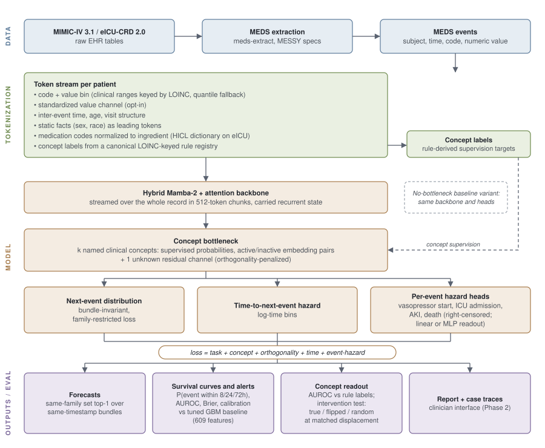

<p align="center">
  
</p>

---

## Goal

Odyssey builds and tests a single general model of a patient's clinical timeline: forecast which events come next and when, produce calibrated time-to-event risk for events that matter (vasopressor start, kidney injury, ICU admission, death), expose named physiological states a clinician can inspect, and, the open frontier, support interventions a clinician can trust ("assume they are hypotensive, what changes?"). That scope is the reason for a sequence model: forecasting whole timelines, timing as survival curves, and interactive what-ifs are capabilities no tabular model family offers at all.

The commitment is to the outcome, not to the method: the goal is the single best model or ensemble system across the three axes below, and the timeline-forecasting pretraining is the current best candidate, not dogma. Adapting on top of it (task heads, ensembling with tabular models, post-training on rollouts, or replacing components outright) is squarely in scope whenever the evidence says so.

The discipline of the project is that this candidate must *earn* each capability against the strongest specialized alternative, on the same data, tasks, and held-out patients, and the current score is stated plainly:

- **Gradient-boosted trees**, tuned per task on a best-effort feature panel (`odyssey/inference/baseline_features.py`). The strongest bar on the shared alert slice, consistent with the tabular-ML literature (Grinsztajn et al. 2022; Shwartz-Ziv & Armon 2022), and currently ahead there: 12/12 event-horizon pairs at 30-shard scale, 10/12 at full MIMIC-IV scale, with the gap narrowing as training data grows.
- **Tabular foundation models** ([TabICLv2](https://github.com/soda-inria/tabicl), `odyssey/inference/tabicl_baseline.py`): pretrained once, applied zero-shot via in-context learning; by the strict definition, the only model in this comparison that is a foundation model today, and in first eICU runs it wins exactly where our hazard head is weakest (AKI, death).
- **Additive models** (EBM, the NAM/GAM family; `odyssey/inference/ebm_baseline.py`): structurally interpretable per-feature curves, no post-hoc explainer. Run on eICU: loses to both the GBM and the hazard head on every legitimate pair; its one apparent win traced to a shared age artifact on a degenerate readmission-like sub-task, so structural interpretability currently costs real performance here.
- **Survival-native foundation models** ([SurvivalPFN](https://github.com/rgklab/SurvivalPFN), `odyssey/inference/survivalpfn_baseline.py`): pretrained on synthetic survival data, fit per event on `(time, censoring)` pairs. Run on eICU: behind the hazard head by 0.03-0.25 AUROC and the GBM by 0.12-0.30 on every fittable event-horizon pair.

These references are bars to clear and *diagnostic probes*: where they win, they localize what the sequence model is missing. The stratified error analysis proved the probe value: the AKI gap tracks the staleness of the last creatinine monotonically (the GBM has `hours_since_last` as an explicit feature; the sequence model must infer it), and the in-ICU gap turns out to be a distinct readmission-like sub-task. Probe wins convert directly into input-design experiments.

Whichever model carries a capability, it must win on three axes at once. (A fourth axis, ease of deployment and compute, is deliberately excluded: bespoke GBMs are cheap to train and deploy but task-specific and need per-site refitting, while foundation-style models generalize and scale with data but cost more compute, ours included; conditioning the comparison on today's compute economics would bias it against exactly the models whose value grows with scale.)

- **Generalizability**: the same pipeline, unchanged, produces a strong model on MIMIC-IV, eICU, and (externally) [GEMINI](https://geminimedicine.ca/). For the sequence model there is a further, harder test it has not yet attempted: pretrain once, transfer across systems, the test TabICL passes by construction and per-task-refit GBMs sidestep by design.
- **Performance**, with **calibration** as a first-class subcomponent (an uncalibrated risk is a performance failure, not a style issue). Scaling behavior is part of this axis: the sequence model improves monotonically with data (set top-1 74.6 to 80.4 across the full-scale learning curve, alert gaps closing concurrently) while the tabular references are static; the comparison is between a curve and a point, and the roadmap tests where the curve goes.
- **Interpretability**, defined causally, where today *no* family passes: SHAP-style attribution is not causal and fails the bar by construction; NAM is structurally interpretable but absent; and our concept bottleneck's lever is, as measured, correlational (interventions move forecasts in proportion to how unusual the forced value is, base-rate correlation 0.97, not whether it is true). Three levers, each with a test: (1) a **faithful readout** of named clinical states, achieved and measured (concept AUROC 0.6 to 0.99 across both datasets); (2) a **concept-level intervention** a clinician can apply, where independent training produced the first genuinely working instance (truth beats no-intervention, correctly ordered) at a real, quantified forecasting cost now being mapped; the near-term clinical what-if extends this lever with input-level counterfactual rollouts (edit the observations that define a state, roll the forecast forward) which require no special training; (3) **population-level causal effect estimation** (amortized causal inference, e.g. CausalPFN and related work from [Rahul G. Krishnan's group](https://www.cs.toronto.edu/~rahulgk/)), a different question (what does this treatment do on average) pursued as an exploratory track rather than a bolted-on claim.

Because demoting competitors to "probes" must not become a one-way ratchet, the promotion criteria are explicit: a reference family becomes the first-class answer for any capability where it matches the sequence model at matched inputs and can either extend to timeline scope or show that scope is clinically unnecessary; conversely, the sequence model loses its default status on any axis where it remains behind at full scale with matched inputs. The honest end state may be a hybrid (sequence model for forecasting and what-ifs, a tabular model for some alerts), and the evaluation is designed to detect that rather than assume it away.

The forecasting itself is framed as a marked temporal point process over same-timestamp bundles: at each step the model forecasts *when* the next bundle arrives (a hazard, so survival curves fall out naturally) and *which* events it contains (a set, scored as such, every event family held to the same bar).

**What success looks like.** A model that forecasts strongly across every event family on unseen patients; calibrated time-to-event alerts that match or beat the tuned references; the same result, pipeline unchanged, on three hospital systems; and at least one intervention mechanism that passes its causal test. Current honest status: forecasting and calibration strong and improving with scale; alerts within 0.01-0.09 AUROC of the tuned GBM at full scale (ahead on 2 of 12 pairs); readout faithful; lever working only under independent training and at a cost; external generalization not yet attempted.

**What this is not.** Not a diagnostic system, not trained on outcome labels, not a claim that the sequence model has already won, and not interpretability by construction: every claim above has a test, and the research journal records where each model falls short.

**Sequencing.** Research questions first, deployment packaging after: (1) can the alert gap be closed with probe-derived inputs and scale; (2) what does a trustworthy lever cost, and can the cost be brought down; (3) does any of it transfer to a third hospital system unchanged.

**Status: active research.** Full-scale runs complete on MIMIC-IV and eICU (second MIMIC epoch training); independent-training lever verified on both; comparator suite run on eICU (GBM strongest overall, TabICL wins targeted spots, EBM and SurvivalPFN not competitive; MEDS-Tab in progress); recency-input experiment confirmed the staleness probe (closes about a third of the AKI gap); GEMINI extraction pipeline built, first full extraction in progress. See [Roadmap](#roadmap).

## Architecture



*Figure: data flows from MIMIC-IV / eICU through MEDS extraction and tokenization into the hybrid Mamba-2 + attention backbone and concept bottleneck, whose heads produce forecasts, survival curves and alerts, and concept readouts (editable source: `docs/figures/architecture.drawio`).*

Inputs per token: the code (with a clinical or quantile value bin folded in), the
standardized numeric value (opt-in value channel), inter-event time, age, visit
structure, and the patient's static facts (sex, race, ...) placed as the first
tokens of the sequence. A no-bottleneck variant (`model_kind="baseline"`, same
backbone and heads) prices the bottleneck. Everything is streamed over each
patient's whole record in 512-token chunks with carried recurrent state.

The concept bottleneck implements Ismail, Adebayo, Bravo, Ra & Cho, ["Concept Bottleneck Generative Models"](https://proceedings.iclr.cc/paper_files/paper/2024/file/9149fc44c95ce58e3ca529a1e34c2691-Paper-Conference.pdf) (ICLR 2024): task loss plus supervised concept loss plus an orthogonality penalty, verified directly against the paper's Section 3.1/Eq. 5 and its official reference code ([prescient-design/CBGM](https://github.com/prescient-design/CBGM), [mateoespinosa/cem](https://github.com/mateoespinosa/cem)), not just the abstract. Each concept (including the unsupervised "unknown" one) is a *mixture of two learned embeddings*, not a scalar; see the module docstring for why that distinction is load-bearing (the paper's own ablation shows removing the unknown concept's embedding capacity, not merely having some free capacity, degrades FID 9.3 to 44.1).

## Installation

**Python ≥ 3.12** and [uv](https://github.com/astral-sh/uv) are required.

```bash
git clone https://github.com/anonymous/anonymised-repo.git
cd odyssey
uv sync --dev
```

The hybrid Mamba-2 + attention backbone depends on `mamba-ssm`, which requires CUDA/`nvcc` to build and cannot be installed on a Mac dev machine. On a CUDA-capable GPU host:

```bash
uv sync --extra cuda --no-build-isolation
```

Local (CPU/MPS) development uses a lightweight stand-in backbone so the concept-bottleneck logic can be built and tested without a GPU; see `tests/odyssey/models/test_concept_bottleneck.py`.

The notes-sidecar text-embedding pipeline (`odyssey/text/embed_notes.py`) depends on `transformers`, an optional extra: `uv sync --extra text` (see `docs/sidecars_and_task_sets.md`).

## Data pipeline

**MEDS is the narrow waist of the whole system.** Each data source gets its own extractor, as source-specific as it needs to be (standard `meds-extract` tooling for MIMIC-IV, a declarative MESSY spec for eICU, a bespoke SQL-streaming extractor for GEMINI's Postgres-only access), but all three converge on the same conformant [MEDS](https://github.com/Medical-Event-Data-Standard/meds) event schema, and everything downstream (binning, tokenization, concepts, training, evaluation, baselines) is written once against that schema and never knows which hospital system produced the data. Conformance at the boundary is enforced mechanically (schema, `metadata/` layout, split directories), not by convention. Deployment readiness follows the same principle: when the best model is settled, a thin MEDS-to-FHIR translator at this boundary is what connects it to live hospital systems, with nothing upstream rearchitected (Track D).

MIMIC-IV to MEDS extraction uses the standard [`meds-extract`](https://github.com/Medical-Event-Data-Standard/MIMIC_IV_MEDS) tooling (`hosp` + `icu` modules only; MIMIC-IV-ED is a separate dataset/DUA and is not yet wired in).

```bash
# No credentials needed, validates the pipeline against the public demo:
uv run meds-extract-run spec=MIMIC-IV output_dir=<output_dir> dataset_key=demo

# Full MIMIC-IV 3.1, already downloaded locally:
uv run meds-extract-run spec=MIMIC-IV output_dir=<output_dir> \
    do_download=false input_dir=<path_to_mimiciv_3.1>
```

`do_download=false` skips *all* downloads, including ten small auxiliary concept-mapping CSVs the pipeline fetches from `MIT-LCP/mimic-code` on GitHub (not PhysioNet) for `extract_code_metadata`; these aren't part of the MIMIC-IV release itself. If you're pointing `input_dir` at a manually-downloaded copy, fetch those into its root first:

```bash
BASE="https://raw.githubusercontent.com/MIT-LCP/mimic-code/v2.4.0/mimic-iv/concepts/concept_map"
for f in meas_chartevents_main.csv inputevents_to_rxnorm.csv lab_itemid_to_loinc.csv \
         meas_chartevents_value.csv numerics-summary.csv outputevents_to_loinc.csv \
         d_labitems_to_loinc.csv proc_datetimeevents.csv waveforms-summary.csv proc_itemid.csv; do
  curl -sSL -o "<path_to_mimiciv_3.1>/$f" "$BASE/$f"
done
```

Validated end-to-end against the real, credentialed MIMIC-IV 3.1 (364,627 subjects, 148,193 distinct codes), not just the demo.

### eICU-CRD

eICU uses the same `meds-extract` tooling with a project-local MESSY spec at [`specs/eICU.yaml`](specs/eICU.yaml) (the reference `eicu-meds` PyPI package predates MESSY and pins an incompatible `meds-transforms`/`polars`, so the extraction is expressed declaratively there instead; see that file's header for the eICU-specific design notes: subjects are health-system stays, and all timestamps are pseudotimes reconstructed from minute offsets, so only intra-subject relative times are meaningful):

```bash
# No credentials needed, validates the pipeline against the public eICU demo:
uv run meds-extract-run spec=./specs/eICU.yaml output_dir=<output_dir> dataset_key=demo

# Full eICU-CRD 2.0, already downloaded locally:
uv run meds-extract-run spec=./specs/eICU.yaml output_dir=<output_dir> \
    do_download=false input_dir=<path_to_eicu_2.0>
```

`odyssey/data/code_mapping.py`'s eICU table translates the extraction's code prefixes (`VITALS//PERIODIC//...`, `LAB//{labname}//...`) to the same LOINC codes the canonical concept rules are grounded in, and `concepts_for_source("eicu")` expands one canonical rule set per source.

Spec v2 (the current file) also fixes two medication-identity gaps in the reference ETL's code shapes: eICU leaves `drugname` empty on 36% of medication rows, but 94% of those carry a HICL code, so medication codes are `MEDICATION//STARTED|STOPPED//{drugname}//{hicl}` and the normalizer resolves the HICL first through a shipped empirical dictionary (`odyssey/data/resources/eicu_hicl_ingredients.csv`, rebuilt from the raw tables by `scripts/build_eicu_hicl_lookup.py`); and infusions are `INFUSION_DRUG//{drugname}` instead of a bare token with the name only in `text_value`. Extractions made with spec v1 still load, they just keep the unnamed rows as `unk`. Set `TrainingConfig.source = "eicu"` so normalization, concept expansion and clinical value ranges all pick the eICU tables.

### Tokenization

`odyssey/data/vocabulary.py` and `odyssey/data/sequences.py` turn raw MEDS events into the batches the model consumes. `odyssey/data/value_binning.py` runs first, folding each numeric-valued event's magnitude into the token itself: `"LAB//220045//bpm"` (a heart-rate reading, any value) becomes `"LAB//220045//bpm::HIGH"`, via curated clinical ranges for the vitals/labs `odyssey/data/concepts.py` already defines thresholds for, and per-code quantile bins (fit on the training split only) elsewhere. Codes with no numeric value (a diagnosis, a procedure) pass through unchanged, since the event's occurrence is already the full signal:

```python
from odyssey.data.value_binning import QuantileBinner, add_value_tokens
from odyssey.data.vocabulary import Vocabulary
from odyssey.data.sequences import build_patient_sequence, collate_patient_sequences

binner = QuantileBinner.fit(train_events, n_bins=5, min_count=100)  # train split only
events = add_value_tokens(events, binner)

vocab = Vocabulary.build(events["code"].to_list(), min_count=10, max_size=20_000)
sequences = [
    build_patient_sequence(events.filter(pl.col("subject_id") == sid), vocab, max_seq_len=512)
    for sid in subject_ids
]
batch = collate_patient_sequences(sequences)  # -> ClinicalSequenceBatch, ready for the model
```

Validated at scale against the real extraction: 500 real patients tokenize in ~2s, mean sequence length ~301 events, 0.8% `[UNK]` rate. Visits are derived from `hadm_id` (events sharing one become one visit; events without one each get their own single-event visit), a documented v1 simplification, see the module docstring. Inter-event time (including gaps *between* admissions, not just within one) is already encoded regardless of value-binning: `PatientSequence.time_stamps` holds each event's absolute time since the sequence's first event, and `TimeEmbeddingLayer(is_time_delta=True)` computes real consecutive-event deltas from it, so it survives truncation and visit boundaries unchanged.

Two more per-token inputs exist alongside the bin token: with `TrainingConfig.value_embeddings=True` the binner's per-code standardized value (`numeric_z`, from `QuantileBinner.standardize`) is projected into the token embedding, so the model sees how far into a bin a reading is (a creatinine of 0.8 vs 1.4 are both `NORMAL` tokens); and timeless facts (`GENDER//F`, race, ...) lead every sequence at the first event's timestamp as inputs that are never prediction targets. Medication codes are normalized to ingredient level (`odyssey/data/code_normalization.py`), on eICU through a shipped HICL dictionary that resolves the 36% of medication rows with no drug name.

Sequences are built from each subject's **complete history**, not scoped to one admission or a fixed window; see `research_journal/02_sequence_scoping_methodology.html` (local-only) for why. The same pipeline runs unchanged on MIMIC-IV and eICU; cross-hospital/health-system generalization will be assessed on [GEMINI](https://geminimedicine.ca/) (~30 hospitals, inpatient), not between MIMIC and eICU.

## GEMINI

Cross-hospital generalization is assessed on [GEMINI](https://geminimedicine.ca/), a ~30-hospital inpatient database in a governed research environment. GEMINI-facing work is git-mediated and privacy-preserving by construction: code goes in through version control, runs inside the environment, and only small, aggregate, cell-suppressed outputs (metrics, summaries) ever come back -- never patient-level data or model checkpoints. See [`docs/gemini.md`](docs/gemini.md) for the full workflow, credential pattern, and governance rules.

## Development

```bash
uv run pytest -m "not integration_test" tests/
uv run ruff check odyssey tests
uv run mypy odyssey
```

## Roadmap

Organized by research track; the foundational plumbing that is finished lives in the collapsed list at the end. The project's central open finding stays at the top where it belongs:

> **The concept lever is not yet causal.** Interventions on concept probabilities move forecasts in proportion to surprise, not truth (base-rate correlation 0.97); RandInt training cannot fix this because it never trains on counterfactual values. Independent training produces the first working lever at a quantified forecasting cost. Mapping and shrinking that cost is the core interpretability work. (Research journal entries 23, 25, 26.)

**Track A: performance and probes**
1. Recency/staleness inputs to the hazard heads (done: improves 9/12 pairs on eICU, AKI@8h 0.681 to 0.697, about a third of the probe-localized gap, at a small set-forecast cost); next lever: curated-signal staleness and last-value channels (v10: built as `signal_channels`, the GBM's own 48-signal panel per position, `odyssey/data/signal_panel.py`; MIMIC A/B queued)
2. Second epoch of full-scale MIMIC-IV training (done 2026-08-22: 275,090 steps, best val loss 2.029; final eval numbers in the registry)
3. MEDS-Tab as the field-standard external baseline on our own MEDS data (drivers in `scripts/meds_tab_*.py`; MIMIC run at the 30-train + 4-held-out matched scope in progress)
4. Comparator suite on eICU (done: tuned GBM strongest overall; TabICL wins AKI and two ICU pairs; EBM and SurvivalPFN not competitive; registry has full tables); MIMIC repeat under the v2 landmark protocol in the re-evaluation wave (`docs/reeval_wave_v2.md`)
5. Backbone control: a modern-vanilla decoder-only transformer (RoPE, pre-norm, SwiGLU; no LLM pre/post-training extras) swapped in behind the same tokenization, losses, heads, and matched parameter and compute budget -- prices the hybrid Mamba-2 + attention choice the way the no-bottleneck variant prices the bottleneck. Subset scale first; full scale only if the subset result is interesting in either direction. If it matches the hybrid, simplicity wins and we switch; if it loses, the architecture choice finally has a measured receipt.
6. Missingness stress protocol (built: `odyssey/data/degrade.py` cells + harness glue + `scripts/missingness_sweep.py`; MIMIC sweep queued), eval-only, all model families on identical degraded records: AUROC/calibration degradation curves under event-level lab dropout, whole-family blackouts, and simulated lab-turnaround lag (charted-time vs actually-available-time, the classic silent deployment gap). Two fairness constraints are the design: degradation applies to the *event record* before each model's own featurization (the GBM recomputes its staleness features on the degraded record, not on frozen features), and it runs under the v2 landmark protocol so the curves are wave-comparable. Motivation: the event-stream paradigm never imputes and models observability explicitly (concept observability head, recency seen-flags), which *should* degrade more gracefully than fixed-feature-panel models -- this measures whether that folklore is true, per family, as a deployment-readiness figure for the paper.
7. Clinical text as a timeline modality, probe-gated (probe built: notes sidecar, `odyssey/text/embed_notes.py`, `strong_text` GBM features; MIMIC run pending the encoder install): a report (MIMIC-IV-Note discharge/radiology text; GEMINI `imaging_result`) becomes a timeline event carrying a precomputed frozen-encoder embedding in a sidecar table, projected into token space at input exactly like the numeric value channel -- backbone unchanged, MEDS waist preserved (sources without notes simply lack the sidecar), and pooled embeddings go to the tabular baselines for a fair comparison. Gated on the cheap headroom test first: pooled report embeddings as extra GBM features on MIMIC alerts; the fusion work proceeds only if text measurably moves the probe.

8. Task-suite expansion (built as `task_set="v2"`: Sepsis-3 concept + alert via `odyssey/data/sofa.py` and the microbiology label sidecar, 30-day readmission scored at discharge with `--index-mode visit_end`; first MIMIC run queued) for the next training generation, born under the landmark protocol: **Sepsis-3 onset** (suspected infection = culture drawn + antibiotics started within the standard window, plus an acute SOFA rise >= 2, built as concept-registry rules with the same windowed-criteria discipline as the KDIGO/AKI labels; diagnosis-code labels rejected deliberately -- discharge billing codes carry no onset time, so a code-based "time to sepsis" is invalid for a real-time task) and **30-day readmission** (discharge-anchored landmarks, a new landmark type on the same hazard machinery; the task where GEMINI's multi-hospital linkage genuinely beats MIMIC). Both get survival/time-to-event formulations, all model families, all three datasets. The GCS coverage gap (eICU) is a stated limitation of the SOFA neuro component, and GEMINI's rescued FiO2/oxygen-support vitals feed the respiratory component directly. A bundling-tolerance/timestamp-jitter check joins the stress-protocol family (item 6): within-bundle order is already ignored by design (set-scored bundles); the open dial is how coarse the bundle window can go before the timeline signal degrades.

9. Model-scale ladder on GEMINI ("curve vs point" made literal): the same pipeline and eval at ~14M (the A100-era config, kept for cross-dataset comparability), ~60M, and ~150M parameters on the H200 -- turns "did the tabular gap close because of data, scale, or both?" into a measured figure instead of an assertion, and sizes the flagship GEMINI run on evidence. Scaling heuristics and the EHR-FM literature both say 14M is undersized for 1.2B events; our own still-climbing epoch-2 curve says it isn't saturated either -- the ladder decides.

**Track B: interpretability and causality**
10. The stage-B cost frontier: longer training, partial unfreezing, small stage-A task weight (M-series, done -- M3b is the working point: 77% of the task gap recovered with a correctly-signed lever; L2-L4 six-mode completion runs queued); acceptance test is the six-mode banded intervention suite
11. Concept-set widening (built as `task_set="v3"`: 11 added LOINC-keyed concepts, electrolytes/glucose/anemia/coagulation/acidosis/shock), plus leakage metrics (built: `odyssey/inference/leakage.py`, CTL capacity-controlled + ICL matrix, per-run; not yet run on a checkpoint)
12. Input-level counterfactual forecasts as the near-term clinician what-if (built: `odyssey/inference/counterfactual.py`, edit the record, re-bin, re-score; cohort run on the MIMIC flagship queued; sampled rollouts are the follow-up)
13. Distributional time head as a frozen-backbone probe (built: `odyssey/inference/time_head_probe.py`; running on the MIMIC flagship): a log-normal mixture over inter-event time fit post-hoc on frozen features (zero pretraining cost), vs the binned hazard on NLL and calibration -- smooth predictive densities and closed-form quantiles for clinician-facing intervals, and the principled sampling machinery the counterfactual rollouts (item 12) need; negative-binomial per-window count head noted as optional utilization output. Completes the Doctor AI arc (their failed L2-on-log-time -> our bins -> mixture densities).
14. Population-level causal effect estimation (exploratory; CausalPFN line)

**Track C: generalization**
15. GEMINI: SQL-streaming MEDS extraction (built, first full extraction in progress), post-extraction MEDS conformance step (int64 subject ids, `metadata/`, deliberate split rule), then external validation of frozen models (`docs/gemini.md`, `scripts/gemini/`)
16. EHRSHOT-style few-shot/transfer protocol, the pretrain-once test
17. Hospital-holdout generalization on eICU-CRD (200+ US ICUs, public and reproducible where GEMINI is governed): subject-to-hospital sidecar from the raw tables (multi-hospital subjects assigned by an explicit rule, not accident), site-holdout evaluation built and debugged here first, then applied unchanged to GEMINI's ~30 hospitals -- two independent multi-site tests with the hierarchy stated honestly (within-dataset cross-site < cross-system external)

**Track D: platform and clinical interface**
18. Reproducibility: environment fingerprints and per-checkpoint numeric canaries recorded with every run (done); landmark protocol versioning on all alert evaluations (done: `LANDMARK_PROTOCOL_VERSION`, re-evaluation wave planned in `docs/reeval_wave_v2.md`)
19. MEDS conformance validator as a gate on every extraction output; thin MEDS-to-FHIR translator once the best model is settled (deployment readiness as an adapter at the MEDS boundary, not a rearchitecture)
20. Phase 2: an LLM agent (e.g. MedGemma) reading the concept-annotated forecast, with retrospective clinician validation on GEMINI; gated on Tracks B and C

<details>
<summary>Foundational work, complete (items 1-8, 10, 12, 13, 16, 17 of the original list)</summary>

MEDS extraction validated end to end on credentialed MIMIC-IV 3.1 and eICU-CRD 2.0 (spec v2: HICL medication identity, named infusions, GCS, urine output); concept bottleneck implemented and tested; rule-derived clinical concept labels (LOINC-keyed canonical registry, per-source expansion); patient-sequence tokenization with clinical-range and quantile value bins, the opt-in standardized value channel, and static facts as leading inputs; streaming truncated-BPTT training over full histories with the shard-streaming corpus path for full-scale runs; bundle-invariant family-restricted loss with family balancing; time-to-next-event and per-event hazard heads with right censoring; the tuned-GBM alert harness with per-row dumps; full-scale pretraining on all MIMIC-IV and eICU shards. Dropped: MIMIC-IV-ED extraction (superseded by the GEMINI track).
</details>

### Known concept-rule limitations

Concept labels are rule-derived, per visit, and evaluated over a visit's whole window (did this happen during the visit), with each concept's first-trigger time also recorded so a running "true as of now" label exists for interventions. Sustained/windowed criteria are used where a single reading over-triggers (`sustained_tachypnea`, KDIGO creatinine windows); GCS-dependent criteria are unavailable on eICU until its nurse-charting table is extracted; full SOFA/NEWS2 as ordinal point-scale concepts are not implemented. AKI staging now covers all three KDIGO legs: creatinine, renal-replacement-therapy initiation (an automatic Stage 3, on mimic-code `rrt.sql`'s active-dialysis itemids), and urine output as a weight-normalized rate (< 0.5 mL/kg/h over 6h / 12h for Stages 1 / 2, < 0.3 mL/kg/h over 24h or 12h of anuria for Stage 3). The rate legs need a charted body weight (daily weight preferred, admission weight as the early-stay fallback) and are left unscored, never defaulted, where none exists -- only ~10-17% of subjects have any weight reading in the MIMIC-IV extraction, so on most patient-positions the rate legs abstain and the creatinine/RRT/anuria legs carry the label.

### GPU notes

The real backbone (`EHRHybridBackbone`, `odyssey/models/backbones/hybrid.py`) runs a Mamba-2 mixer and an attention mixer in parallel on every position, fused by a small learned attention (`MergeAttention`), not a sequential stack, so it's built directly rather than through `mamba_ssm`'s high-level `MixerModel` dispatcher, which only supports one mixer per block. The Mamba branch carries real state across TBTT chunks (`hybrid.py` patches a minimal `Mamba2` subclass that seeds `mamba_chunk_scan_combined`'s `initial_states`, which upstream never wires up); the attention branch runs fresh, full attention over just the current chunk, with no cross-chunk memory, a deliberate trade-off, not a bug: Mamba handles compressed long-range recall across the whole sequence, attention handles precise local recall within a chunk. See `_make_mamba2_with_state_cls` in that module and `research_journal/03_backbone_architecture.html` (local-only) for the full writeup.

## Citation

Citation information is omitted for anonymous review and will be
provided with the camera-ready version.
